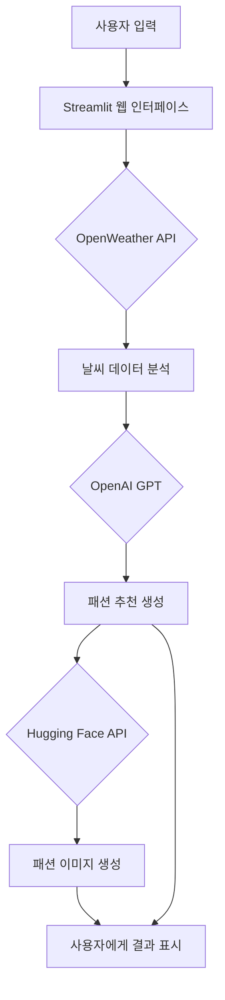

# 패션 추천 AI (with.weather)

## 프로젝트 개요

**패션 추천 AI**는 실시간 날씨 정보와 사용자의 개인 정보(성별, 키, 몸무게, 스타일 선호도)를 분석하여 최적의 패션 코디를 추천하고, 인공지능 이미지 생성 기술을 통해 시각화해주는 웹 애플리케이션입니다.

여러 API와 인공지능 모델을 활용하여 사용자에게 맞춤형 패션 추천을 제공합니다:
- **OpenWeather API**: 실시간 날씨 정보 수집
- **OpenAI GPT**: 날씨와 체형에 맞는 패션 코디 추천
- **Hugging Face Stable Diffusion**: 추천된 패션의 시각화

## 핵심 기능

1. **실시간 날씨 기반 패션 추천**
   - 도시별 온도, 날씨 상태, 습도 등 실시간 정보 반영
   - 날씨에 적합한 옷차림과 레이어링 제안

2. **체형 맞춤형 스타일링**
   - BMI 계산을 통한 체형 분석
   - 성별과 체형에 어울리는 실루엣 및 디자인 제안

3. **개인 스타일 선호도 반영**
   - 선호하는 색상, 스타일, 브랜드 등 고려
   - 개인화된 패션 추천 생성

4. **AI 이미지 생성**
   - 추천된 패션을 시각화한 이미지 생성
   - 사용자의 성별과 체형을 반영한 패션 이미지 제공

## 시스템 아키텍처



## 기술 스택

- **Frontend/Backend**: Streamlit
- **AI/ML**: 
  - OpenAI GPT-4o-mini (텍스트 기반 패션 추천)
  - Hugging Face Stable Diffusion (이미지 생성)
- **APIs**:
  - OpenWeather API (날씨 정보)
  - OpenAI API (GPT 모델)
  - Hugging Face Inference API (Stable Diffusion)
- **기타 라이브러리**:
  - Python-dotenv (환경변수 관리)
  - Pillow (이미지 처리)
  - Requests (API 통신)

## 설치 및 실행 방법

### 1. 필수 요구사항
- Python 3.8 이상
- pip (Python 패키지 관리자)
- 인터넷 연결

### 2. 설치 과정

1. **저장소 클론 또는 다운로드**
   ```bash
   git clone <저장소 URL>
   cd Weather_fashion_AI
   ```

2. **가상환경 생성 및 활성화**
   ```bash
   python3 -m venv venv
   source venv/bin/activate  # Windows: venv\Scripts\activate
   ```

3. **필수 패키지 설치**
   ```bash
   pip install -r requirements.txt
   ```

4. **환경 변수 설정**
   `.env` 파일을 생성하고 다음 API 키를 설정:
   ```
   OPENWEATHER_API_KEY=your_openweather_api_key
   OPENAI_API_KEY=your_openai_api_key
   HUGGINGFACE_API_KEY=your_huggingface_api_key
   ```

### 3. 실행 방법
```bash
streamlit run app.py
```
웹 브라우저에서 자동으로 `http://localhost:8501`에 접속됩니다.

## 사용 가이드

1. **사이드바에서 정보 입력**
   - 도시 이름 (영문): 날씨 정보를 확인할 도시 (예: Seoul, Tokyo, New York)
   - 성별: 남성/여성 선택
   - 키(cm)와 몸무게(kg): 체형에 맞는 패션 추천을 위한 정보
   - 스타일 선호도: 선호하는 스타일, 색상, 브랜드 등을 자유롭게 입력

2. **'패션 추천 받기' 버튼 클릭**

3. **결과 확인**
   - 현재 날씨 정보 표시 (온도, 날씨 상태, 습도)
   - 패션 추천 텍스트
   - AI가 생성한 패션 이미지

## 개발자 정보

- 본 프로젝트는 날씨 정보와 인공지능을 활용한 패션 추천 서비스 구현을 목표로 개발되었습니다.
- 기여 및 문의: wjdghksgml5754@gmail.com

## 라이선스 및 주의사항

- 본 애플리케이션은 API 키가 필요한 외부 서비스에 의존합니다.
- API 사용량 제한:
  - OpenAI API: 유료 사용량에 따라 요금 발생
  - Hugging Face API: 하루 약 30,000개의 무료 요청 가능
  - OpenWeather API: 무료 플랜의 경우 분당 60회 제한

- AI 생성 이미지는 실제 패션과 차이가 있을 수 있으며, 참고용으로만 사용하세요.
